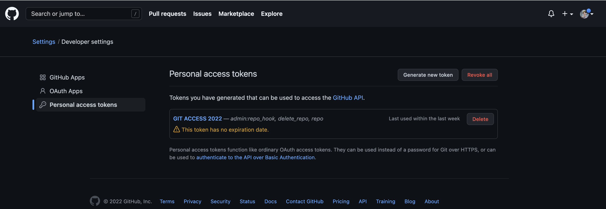

## Reference
* [Github 토큰 인증 오류 해결하기](https://miracleground.tistory.com/entry/GitHub-%ED%86%A0%ED%81%B0-%EC%9D%B8%EC%A6%9D-%EB%A1%9C%EA%B7%B8%EC%9D%B8-%ED%95%98%EA%B8%B0-%EC%98%A4%EB%A5%98-%ED%95%B4%EA%B2%B0-remote-Support-for-password-authentication-was-removed-on-August-13-2021-Please-use-a-personal-access-token-instead)
* [Git credential 저장](https://www.hahwul.com/2018/08/22/git-credential-helper/)

---

# [오류 해결]: remote: Support for password authentication was removed on August 13, 2021. Please use a personal access token instead.
github > settings > Developer settings - Personal access tokens >> Generate new token  
  

* [Github 토큰 인증 오류 해결하기](https://miracleground.tistory.com/entry/GitHub-%ED%86%A0%ED%81%B0-%EC%9D%B8%EC%A6%9D-%EB%A1%9C%EA%B7%B8%EC%9D%B8-%ED%95%98%EA%B8%B0-%EC%98%A4%EB%A5%98-%ED%95%B4%EA%B2%B0-remote-Support-for-password-authentication-was-removed-on-August-13-2021-Please-use-a-personal-access-token-instead)

# Git credential 저장
>  \> git config credential.helper store --global